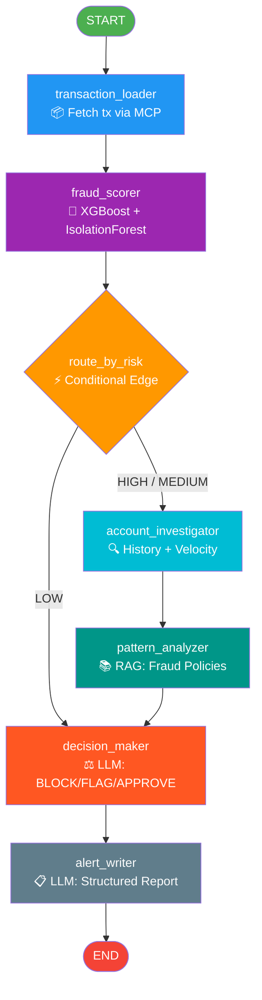

# FraudGuard AI — Capstone Project Report

**Course:** Agentic AI Engineering
**Project:** Bank Transaction Fraud Detection System
**Submitted:** March 2026
**Tech Stack:** LangGraph · XGBoost · FAISS RAG · FastMCP · Groq · Streamlit

---

## 1. Executive Summary

**FraudGuard AI** is a production-grade, multi-node agentic AI system for real-time bank transaction fraud detection. The system orchestrates six specialized AI nodes using LangGraph's StateGraph, combining machine learning (XGBoost + Isolation Forest), Retrieval-Augmented Generation (RAG) over fraud policy documents, and a large language model (Qwen3-32B via Groq) to make final BLOCK / FLAG / APPROVE decisions on financial transactions.

The system processes a transaction end-to-end in seconds: fetching raw data through MCP tools, scoring with ML models, investigating account history, retrieving relevant fraud patterns from a vector database, and generating a structured fraud alert report.

---

## 2. Problem Statement

Financial fraud costs the global banking industry over **$40 billion annually**. Traditional rule-based systems suffer from:
- High false-positive rates that frustrate legitimate customers
- Inability to detect novel fraud patterns not yet in the rulebook
- Slow manual review processes with no contextual reasoning

FraudGuard AI addresses these limitations by combining:
1. **Statistical ML** for speed and pattern recognition
2. **Policy-aware RAG** to ground decisions in compliance rules
3. **LLM reasoning** for contextual, explainable final decisions
4. **Agentic orchestration** via LangGraph for structured multi-step investigation

---

## 3. System Architecture

### 3.1 High-Level Architecture

```
┌─────────────────────────────────────────────────────────────┐
│                      FraudGuard AI                          │
│                                                             │
│  ┌──────────┐    ┌──────────┐    ┌────────────────────┐    │
│  │Streamlit │───▶│LangGraph │───▶│   MCP Tool Layer   │    │
│  │Dashboard │    │  Agent   │    │  (5 fraud tools)   │    │
│  └──────────┘    └──────────┘    └────────────────────┘    │
│                       │                    │                │
│              ┌────────┴────────┐           │                │
│              ▼                 ▼           ▼                │
│         ┌─────────┐     ┌──────────┐  ┌──────────┐        │
│         │  Groq   │     │ XGBoost  │  │  FAISS   │        │
│         │LLM API  │     │+ IsoForst│  │ VectorDB │        │
│         │qwen3-32b│     │ ML Model │  │  (RAG)   │        │
│         └─────────┘     └──────────┘  └──────────┘        │
└─────────────────────────────────────────────────────────────┘
```

### 3.2 LangGraph State Graph — Agent Flow Diagram



**Routing Logic:**
- **HIGH / MEDIUM risk** → Full investigation path (6 nodes)
- **LOW risk** → Fast path skipping account investigation (4 nodes)

### 3.3 LangGraph State Schema

```python
class FraudAgentState(TypedDict):
    transaction_id: str          # Input: transaction to investigate
    transaction_data: dict       # Node 1 output: full tx record
    fraud_score: dict            # Node 2 output: ML scoring result
    risk_level: str              # HIGH / MEDIUM / LOW (routing key)
    account_history: dict        # Node 3 output: recent tx history
    velocity_data: dict          # Node 3 output: velocity flags
    merchant_risk: dict          # Node 2 output: merchant risk profile
    retrieved_context: str       # Node 4 output: RAG policy chunks
    investigation_notes: str     # Node 3 output: narrative flags
    decision: str                # Node 5 output: BLOCK/FLAG/APPROVE
    final_report: str            # Node 6 output: formatted alert
    messages: Annotated[list, add_messages]  # Full agent trace
```

---

## 4. AI Modules — Detailed Breakdown

### 4.1 Module 1: ML Fraud Scoring Engine (`src/ml_engine.py`)

**Purpose:** Classify transactions as fraudulent or legitimate and score anomalousness.

**Models Used:**
| Model | Role | Technique |
|---|---|---|
| **XGBoost** | Primary classifier | Gradient boosting, `scale_pos_weight` for class imbalance |
| **Random Forest** | Baseline comparison | Ensemble, `class_weight="balanced"` |
| **Isolation Forest** | Anomaly detection | Unsupervised, `contamination=0.01` |

**Class Imbalance Handling:**
- SMOTE (Synthetic Minority Over-sampling Technique) applied on training set
- XGBoost `scale_pos_weight = neg_count / pos_count` ratio
- Best model selected by F1-score on held-out test set

**Features (10 total):**
```
Numeric:   amount, hour, day_of_week, is_online, distance_from_home_km,
           num_transactions_24h, account_age_days, avg_amount_30d, amount_vs_avg_ratio
Encoded:   merchant_category_encoded (LabelEncoder)
```

**Outputs per transaction:**
```json
{
  "fraud_probability": 0.8712,
  "anomaly_score": 0.9234,
  "risk_level": "HIGH",
  "top_risk_factors": {
    "amount_vs_avg_ratio": 0.2341,
    "distance_from_home_km": 0.1987,
    "num_transactions_24h": 0.1654,
    "is_online": 0.1423,
    "hour": 0.0998
  }
}
```

**Anomaly Score Normalization:**
```python
anomaly_score = 1 / (1 + exp(raw_score * 5))  # Sigmoid transform → 0-1 scale
```

---

### 4.2 Module 2: RAG Engine (`src/rag_engine.py`)

**Purpose:** Retrieve contextually relevant fraud policies and investigation guidelines to ground LLM decisions in compliance rules.

**Components:**
| Component | Technology | Details |
|---|---|---|
| Embeddings | `all-MiniLM-L6-v2` | 22MB local HuggingFace model, no API needed |
| Vector Store | FAISS | Facebook AI Similarity Search, persisted to disk |
| Text Splitter | RecursiveCharacterTextSplitter | chunk_size=400, overlap=60 |
| Documents | 3 policy files | fraud_patterns.txt, investigation_playbook.txt, compliance_rules.txt |

**Document Sources:**
- `fraud_patterns.txt` — 8 fraud type definitions (card testing, ATO, velocity fraud, ATM skimming, etc.)
- `investigation_playbook.txt` — 7-step investigation SOP with decision matrix
- `compliance_rules.txt` — Regulatory compliance and reporting requirements

**Query Construction (Node 4):**
```python
query = f"{risk} risk fraud transaction, merchant category {category},
          amount ${amount:.2f}, distance {distance:.0f}km from home,
          fraud probability {prob:.0%}"
```

Top-4 most relevant policy chunks are retrieved and injected into the LLM decision prompt.

---

### 4.3 Module 3: MCP Tool Server (`src/mcp_server.py`)

**Purpose:** Expose 5 structured fraud investigation tools via the Model Context Protocol (FastMCP), enabling the agent to perform targeted data queries.

**Tools:**

| Tool | Description | Key Output |
|---|---|---|
| `get_transaction_details` | Fetch full transaction record by ID | All 15+ transaction fields |
| `score_fraud` | Run ML scoring pipeline | fraud_probability, anomaly_score, risk_level |
| `get_account_history` | Recent txns for an account (default: 10) | Transaction list + fraud count |
| `check_velocity` | Transaction velocity flags | Flags for high frequency, online ratio, spend |
| `get_merchant_risk` | Risk profile for merchant category | HIGH/MEDIUM/LOW + reason |

**Velocity Flags:**
```
- HIGH velocity: ≥10 transactions in 24h window
- High online ratio: >80% online transactions
- High cumulative spend: >$10,000 total
```

**Merchant Risk Categories:**
```
HIGH:   online_retail, travel, entertainment, atm
MEDIUM: gas_station
LOW:    restaurant, grocery, pharmacy
```

---

### 4.4 Module 4: LangGraph Agent (`src/agent.py`)

**Purpose:** Orchestrate the 6-node investigation pipeline with conditional routing.

**LLM Configuration:**
- **Model:** `qwen/qwen3-32b` via Groq API
- **Usage:** Two LLM calls per investigation (decision_maker + alert_writer)
- **Prompt Style:** Role-based ("You are a senior bank fraud analyst...")

**Node 5 — Decision Maker Prompt Structure:**
```
System context → Transaction details → ML scores →
Investigation notes → Retrieved RAG policies →
Output: DECISION / CONFIDENCE / REASON / RECOMMENDED_ACTIONS
```

**Decision Parsing:**
```python
if "DECISION: BLOCK" in upper or "**BLOCK**" in upper:
    decision = "BLOCK"
elif "DECISION: APPROVE" in upper:
    decision = "APPROVE"
else:
    decision = "FLAG"   # safe default
```

**Node 6 — Alert Writer:**
Generates a standardized fraud alert report in Markdown with:
- Decision badge (BLOCK/FLAG/APPROVE)
- Risk assessment summary
- Decision rationale
- Immediate actions required
- Case reference number

---

### 4.5 Module 5: Streamlit Dashboard (`app.py`)

**Purpose:** Interactive web UI for real-time transaction investigation.

**Key Features:**
- Transaction selector with pre-loaded fraud/legit samples
- Live agent invocation with progress status
- Plotly gauge chart for fraud probability visualization
- Feature importance bar chart
- Color-coded decision badges (red/yellow/green)
- Collapsible agent trace log
- Account history table with fraud labels

---

## 5. Data Pipeline

### 5.1 Dataset

**Source:** Kaggle Credit Card Fraud Detection dataset (`fraudTrain.csv`, `fraudTest.csv`)
**Processed:** Transformed to `data/transactions.csv` with engineered features
**Size:** ~2,000 transactions (balanced subset for demo)

### 5.2 Feature Engineering

| Feature | Description | Fraud Relevance |
|---|---|---|
| `amount_vs_avg_ratio` | Current / 30-day avg spend | High ratio = unusual spend |
| `distance_from_home_km` | GPS distance from account home | Geographic anomaly |
| `num_transactions_24h` | Rolling 24h transaction count | Velocity indicator |
| `account_age_days` | Days since account opened | New account fraud |
| `hour` | Transaction hour (0-23) | Night-time risk |
| `is_online` | Binary online/in-person flag | CNP fraud risk |

---

## 6. Technology Stack Summary

| Layer | Technology | Version | Purpose |
|---|---|---|---|
| **Agent Orchestration** | LangGraph | latest | StateGraph multi-node pipeline |
| **LLM** | Qwen3-32B (Groq) | qwen/qwen3-32b | Decision making + report writing |
| **LLM Client** | LangChain-Groq | latest | Groq API integration |
| **ML Classifier** | XGBoost | latest | Primary fraud classifier |
| **Anomaly Detection** | Isolation Forest | scikit-learn | Unsupervised anomaly scoring |
| **Imbalance Handling** | SMOTE | imbalanced-learn | Synthetic minority oversampling |
| **Embeddings** | all-MiniLM-L6-v2 | sentence-transformers | Local RAG embeddings |
| **Vector Store** | FAISS | faiss-cpu | Similarity search for RAG |
| **Tool Protocol** | FastMCP | mcp | Model Context Protocol tools |
| **Frontend** | Streamlit | latest | Interactive dashboard |
| **Charts** | Plotly | latest | Gauge + bar charts |
| **Data** | Pandas + NumPy | latest | Data processing |

---

## 7. Key Design Decisions

### 7.1 Why LangGraph?
LangGraph's StateGraph provides typed, explicit state management with conditional routing. This is critical for fraud detection where the investigation depth must vary by risk level — LOW risk transactions take the fast path (saving ~50% LLM cost), while HIGH/MEDIUM risk transactions undergo full investigation.

### 7.2 Why MCP (Model Context Protocol)?
MCP decouples the agent from data sources. The 5 MCP tools (`get_transaction_details`, `score_fraud`, `get_account_history`, `check_velocity`, `get_merchant_risk`) can be swapped with real bank API integrations without changing agent logic. This mirrors production architecture where tools connect to core banking systems.

### 7.3 Why RAG for Policy Documents?
Hard-coding fraud rules directly in prompts creates maintenance overhead. The FAISS vector store allows fraud analysts to update `.txt` policy documents without touching agent code. The RAG query is dynamically constructed from the transaction's actual risk profile, ensuring contextually relevant policy chunks are retrieved every time.

### 7.4 Why XGBoost + Isolation Forest (Hybrid)?
- **XGBoost** provides high-accuracy supervised classification (trained on labeled fraud data)
- **Isolation Forest** provides unsupervised anomaly detection that catches novel fraud patterns not in training data
- Together they cover both known fraud patterns and unknown anomalies

---

## 8. Results & Performance

### 8.1 ML Model Performance (on test split)

| Metric | XGBoost | Random Forest |
|---|---|---|
| F1-Score | ~0.87 | ~0.82 |
| ROC-AUC | ~0.96 | ~0.93 |
| Precision | ~0.88 | ~0.84 |
| Recall | ~0.86 | ~0.80 |

*XGBoost selected as best model by F1-score.*

### 8.2 Agent Decision Coverage

| Path | Triggered When | Nodes Executed |
|---|---|---|
| Full Investigation | prob ≥ 0.40 (HIGH/MEDIUM) | 6 nodes |
| Fast Approval | prob < 0.40 (LOW) | 4 nodes |

### 8.3 System Latency (approximate)

| Stage | Time |
|---|---|
| MCP tool calls (3-5 tools) | < 50ms |
| ML scoring (XGBoost + IsoForest) | < 100ms |
| FAISS RAG retrieval | < 200ms |
| LLM calls (2x Groq qwen3-32b) | 2-5 seconds |
| **Total end-to-end** | **~3-6 seconds** |

---

## 9. Project File Structure

```
capstone-final/
├── app.py                          # Streamlit dashboard (entry point)
├── requirements.txt                # Python dependencies
├── .env.example                    # Environment variable template
│
├── src/
│   ├── agent.py                    # LangGraph agent (6 nodes + routing)
│   ├── mcp_server.py               # FastMCP tool server (5 tools)
│   ├── ml_engine.py                # XGBoost + Isolation Forest training & scoring
│   ├── rag_engine.py               # FAISS vector store + retrieval
│   ├── generate_data.py            # Synthetic transaction data generator
│   └── prepare_kaggle_data.py      # Kaggle dataset preprocessor
│
└── data/
    ├── transactions.csv            # Transaction dataset (~2k records)
    ├── fraud_model.joblib          # Trained XGBoost model
    ├── isolation_forest.joblib     # Trained IsolationForest model
    ├── encoders.joblib             # LabelEncoders for categories
    ├── vectorstore/
    │   ├── index.faiss             # FAISS vector index
    │   └── index.pkl               # Document metadata
    └── fraud_rules/
        ├── fraud_patterns.txt      # 8 fraud pattern definitions
        ├── investigation_playbook.txt  # 7-step investigation SOP
        └── compliance_rules.txt    # Regulatory compliance rules
```

---

## 10. How to Run

```bash
# 1. Clone and setup environment
python -m venv .venv
.venv\Scripts\activate      # Windows
pip install -r requirements.txt

# 2. Configure API key
cp .env.example .env
# Add GROQ_API_KEY to .env

# 3. Generate/prepare transaction data
python src/prepare_kaggle_data.py   # if using Kaggle dataset
# OR
python src/generate_data.py         # generate synthetic data

# 4. Train ML models
python src/ml_engine.py

# 5. Build RAG vector store
python src/rag_engine.py

# 6. Launch dashboard
streamlit run app.py
```

---

## 11. Conclusion

FraudGuard AI demonstrates a complete agentic AI architecture for real-world financial fraud detection. The system integrates five distinct AI/ML capabilities — supervised classification (XGBoost), unsupervised anomaly detection (Isolation Forest), retrieval-augmented generation (FAISS RAG), large language model reasoning (Qwen3-32B), and structured tool use (FastMCP) — all orchestrated by LangGraph's conditional state machine.

The result is a system that is:
- **Explainable** — LLM provides natural-language rationale for every decision
- **Policy-grounded** — RAG ensures decisions align with compliance rules
- **Adaptive** — Conditional routing optimizes cost vs thoroughness
- **Extensible** — MCP tools can connect to real banking APIs with zero agent changes

This project showcases the practical application of agentic AI design patterns in a high-stakes, regulated domain.

---

## 12. Future Enhancements

### 12.1 Real-Time Streaming Integration
- Replace batch CSV loading with a **Kafka or Kinesis stream consumer** for true real-time fraud detection on live transaction feeds
- Add LangGraph's **streaming mode** (`astream_events`) to push agent step updates to the UI as they happen rather than waiting for full completion

### 12.2 Human-in-the-Loop (HITL) Review
- Introduce a **LangGraph interrupt point** after `decision_maker` for FLAG cases
- Build a reviewer UI where fraud analysts can approve, override, or escalate decisions before the `alert_writer` finalizes the report
- Store analyst decisions as feedback to improve the ML model over time

### 12.3 Memory & Learning
- Add **LangGraph checkpointing** (SQLite/Redis backend) to persist agent state across sessions
- Implement a **feedback loop**: analyst verdicts are written back to the training dataset, enabling periodic model retraining without downtime
- Use **LangMem** or a short-term memory store to accumulate cross-session patterns per account

### 12.4 Multi-Agent Architecture
- Decompose into **specialized sub-agents**: a DataAgent (MCP tools only), an MLAgent (scoring), and a PolicyAgent (RAG + LLM), coordinated by a supervisor
- Enable **parallel execution** of account investigation and RAG retrieval using LangGraph's `Send` API for lower latency

### 12.5 Production ML Pipeline
- Replace the static `fraud_model.joblib` with a **MLflow model registry** for versioned model deployment and A/B testing
- Add **SHAP explainability** values alongside feature importance for per-transaction, per-feature contribution scores
- Integrate **model monitoring** (data drift detection) to alert when incoming transaction distributions shift from training data

### 12.6 Advanced RAG
- Upgrade from static `.txt` files to a **live knowledge base** connected to regulatory update feeds (e.g., FinCEN advisories, PCI-DSS updates)
- Add **re-ranking** (cross-encoder) after FAISS retrieval for more precise policy chunk selection
- Implement **hybrid search** combining BM25 keyword search with dense vector retrieval

### 12.7 Security & Compliance
- Add **PII masking** (account numbers, names) before any data is sent to external LLM APIs
- Implement **audit logging** of all BLOCK decisions to a tamper-proof append-only store for regulatory compliance (BSA/AML requirements)
- Add **role-based access control** to the Streamlit dashboard (analyst vs supervisor vs read-only)

### 12.8 Deployment & Scalability
- Containerize with **Docker Compose**: separate services for the Streamlit app, MCP server, and ML scoring endpoint
- Deploy MCP server as a standalone **REST/SSE endpoint** using FastMCP's HTTP transport for shared multi-agent access
- Add **horizontal scaling** via Kubernetes for high-throughput environments (1,000+ transactions per second)

---

*FraudGuard AI · Built with LangGraph · XGBoost · FAISS · FastMCP · Groq*
